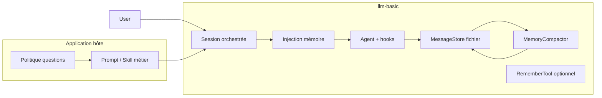

# Mémoire conversationnelle — analyse et feuille de route

Document de conception pour faciliter, via **llm-basic**, le développement d’applications où un LLM mène une conversation longue (ex. l’utilisateur se décrit), pose des questions de clarification **sans excès** sur les sujets nouveaux, et construit une mémoire durable au fil des échanges.

Date : 2026-06-04  
Contexte : discussion de design après l’introduction de `MessageStoreInterface` et `MemoryCompactor` (v0.21.0).

---

## Cas d’usage cible

- Conversation dédiée où l’utilisateur se décrit (profil, onboarding, coaching, etc.).
- Le LLM peut poser des questions pour clarifier, mais ne doit pas « s’enfermer » dans des questions trop détaillées si le sujet vient d’apparaître.
- La mémoire se construit progressivement ; un sujet flou peut être **noté** et approfondi dans une **session ultérieure** s’il est important pour l’utilisateur.
- Le modèle a déjà une capacité naturelle à synthétiser ; la lib doit **fiabiliser, persister et orchestrer** plutôt que remplacer cette capacité.

---

## État actuel dans llm-basic

### Composants existants

| Composant | Rôle |
|-----------|------|
| `MessageStoreInterface` | Persistance messages, mémoire longue durée, archives, métriques caractères, formatage pour résumé |
| `MemoryCompactor` | Quand le seuil de caractères est dépassé : archive les anciens messages, fusionne un résumé dans la mémoire via `LLM::chatCompletion()`, garde une fenêtre récente configurable |
| `Agent` + `AgentHooks` | Exécution d’un tour (tools, `BeforeTurn` / `AfterTurn`, etc.) |
| `Conversation` / `Message` | Historique avec `meta` (ex. `created_at`) |
| `Skill` | Prompts réutilisables (`WriterSkill`, `TranslatorSkill`, …) |
| `Logger` | Snapshot JSON de conversation (fichier), sans mémoire structurée |

### Ce que fait `MemoryCompactor` aujourd’hui

- Problème principalement **technique** : gestion de la fenêtre de contexte.
- Prompt de fusion figé (journal markdown chronologique, faits datés, concision).
- `$summarySystemPrompt` injectable ; le **prompt utilisateur** de fusion reste interne à la classe.
- Variables d’environnement via `fromEnv()` : `CONTEXT_CHAR_THRESHOLD`, `KEEP_RECENT_MESSAGES`, `MIN_KEEP_MESSAGES`.

### Lacunes par rapport au cas d’usage

1. **Pas de chaînage** `MessageStore` → injection mémoire → `Agent` → persistance → compaction.
2. **Pas d’implémentation fichier** de `MessageStoreInterface` dans la lib (uniquement store in-memory dans `tests/memory_compactor_test.php`).
3. **Pas d’exemple** ni de `test.php` utilisant mémoire / compactor.
4. Mémoire = **journal générique** ; pas de structure « profil » (confirmé / provisoire / sujets ouverts).
5. Pas d’outil pour que le LLM **écrive explicitement** en mémoire pendant le tour (seulement fusion batch à la compaction).
6. Archives créées mais **pas d’API de relecture** pour retrouver un fil passé.
7. La politique « profondeur des questions » reste **prompt + produit** ; la lib ne fournit pas encore de garde-fous structurels.

---

## Principe de séparation lib / application

| Dans llm-basic (mécanismes) | Dans l’application hôte (politique) |
|-----------------------------|-------------------------------------|
| Orchestration tour, persistance, compaction | Prompt métier exact (ton, persona, langue) |
| Injection standard de la mémoire dans le contexte | Règles fines (« max N questions par thème nouveau ») |
| Formats de mémoire / summarizers pluggables | Modération, consentement, UI |
| `FileMessageStore`, hooks compaction | Choix modèle, température, déploiement |

---

## Pistes d’évolution (par priorité)

### P1 — Orchestration « session conversationnelle » (haute priorité)

Classe du type `ConversationalSession` / `MemoryAwareSession` :

1. Charger messages + mémoire depuis `MessageStoreInterface`
2. Construire `Conversation` (system + bloc mémoire + historique récent)
3. `Agent::runTurn()`
4. Persister message utilisateur et réponse assistant
5. `MemoryCompactor::compactIfNeeded()` (idéalement via `AfterTurn` ou méthode dédiée)
6. Exposer `contextProgress()` pour l’UI

**Objectif** : éviter que chaque app recolle manuellement les briques.

### P1 — Injection standard de la mémoire

Helpers possibles :

- `ConversationBuilder::fromStore(MessageStoreInterface $store, string $systemPrompt): Conversation`
- ou `Message::memoryContext(string $memory)` / section markdown conventionnelle dans le system prompt

**Convention** : où la mémoire apparaît (system vs message dédié) pour rester cohérent avec la compaction.

### P1 — `FileMessageStore` (implémentation de référence)

Sur le modèle de `Logger` :

- Fichiers typiques : `messages.json`, `memory.md`, `archives/{id}.json`
- Support optionnel `conversationId` / `userId` pour plusieurs fils
- Conversion `array{role, content, meta}` ↔ `Message`

### P2 — Mémoire structurée et summarizers pluggables

Format orienté profil (exemple) :

```markdown
## Confirmé
- ...

## Provisoire / à préciser
- ...

## Sujets mentionnés mais laissés ouverts
- ...

## Questions déjà posées (éviter redites)
- ...
```

Dans la lib :

- Extraire le prompt de fusion de `MemoryCompactor` vers une stratégie configurable ;
- ou `MemorySummarizerInterface` avec `JournalSummarizer` (actuel) et `ProfileSummarizer`.

Encode « noter sans creuser tout de suite » sans imposer le texte métier du bot.

### P2 — Skill réutilisable

`ProfileDiscoverySkill` / `GuidedConversationSkill` :

- Règles system : profondeur des questions, une question à la fois, accepter l’ambiguïté, s’appuyer sur la mémoire, etc.
- `formatQuery()` pour phases optionnelles (`intro`, `follow_up`, `recap`)

### P3 — Outil `RememberTool` / `UpdateMemoryTool`

- Le LLM enregistre un delta structuré (`fact`, `confidence`, `topic`, `status`)
- L’app ou un merge PHP valide avant `saveMemory()`
- **Compaction** = batch / fenêtre ; **tool** = delta immédiat

### P3 — Archives consultables

Extensions `MessageStoreInterface` ou store fichier :

- `listArchives()`, `loadArchive(id)`
- Optionnel : outil de recherche (grep mémoire + archives)

### P3 — Hooks / événements mémoire

- `MemoryCompactionHooks::attach(AgentHooks $hooks, …)` ou événement `AfterMemoryCompact`
- Métadonnées : `archive_id`, taille mémoire, etc.

### P4 — Extracteur léger par tour (optionnel)

- `MemoryExtractor::extractDelta(lastTurn, existingMemory)` après chaque tour
- Coût tokens supplémentaire ; à activer seulement si besoin

### P4 — Exemple et tests d’intégration

- `examples/06_profile_conversation.php` : boucle stdin, store fichier, injection mémoire, compaction
- Tests d’intégration au-delà du smoke test de planning actuel

---

## Architecture cible (vue d’ensemble)



---

## Ordre d’implémentation recommandé

| Phase | Livrables | Impact |
|-------|-----------|--------|
| **1** | `FileMessageStore`, `ConversationBuilder` (injection mémoire), `ConversationalSession` | Débloque la majorité des apps multi-tours |
| **2** | Prompt de fusion configurable / `ProfileSummarizer`, `GuidedConversationSkill`, `examples/06_…` | Aligne sémantique mémoire + doc |
| **3** | `RememberTool`, API archives, hooks compaction | Qualité mémoire et observabilité |
| **4** | Extracteur par tour (si besoin) | Optimisation |

---

## Fichiers existants à connaître

- `src/MemoryCompactor.php` — compaction et fusion LLM
- `src/MessageStoreInterface.php` — contrat persistance
- `tests/memory_compactor_test.php` — `InMemoryMessageStore`, tests de planning
- `src/Agent.php`, `src/AgentHooks.php` — exécution et extension
- `src/Skill.php`, `src/Skills/*` — modèle pour prompts réutilisables

---

## Références

- Changelog v0.21.0 : introduction `MessageStoreInterface` + `MemoryCompactor`
- Question produit d’origine : bot d’auto-description avec questions modérées et mémoire progressive
